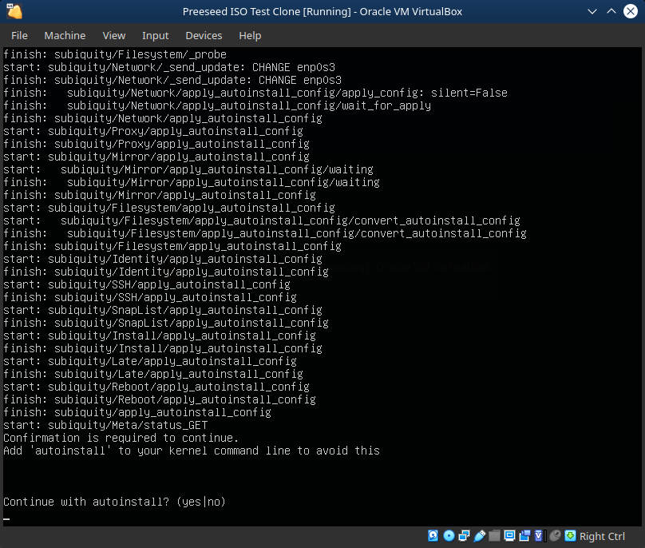

# How to run Ubuntu Autoinstall Provisioning on Various VMs

I hate bad documentation, but I figured this out.  I was using debian preseeding (d-i) for the longest time, but "they" decided to do away with it, and I was forced to adapt.  The documention is kind of scant.  I tried their converter, "autoinstall-generator," but it wouldn't work on my preseeds. Maybe they fixed it by the time you read this.  

## Ubuntu Autoinstall on Virtualbox

* Download a "Ubuntu Server Live" ISO from either 20.04 (old and busted, which I heartly recommend for a long term server) or 21.04 (new hotness)
* On an Ubuntu box, intsall the cloud image utilities `apt install cloud-image-utils`
* Make a directory to keep things clean. In the example they give you, it was `~/cidata` so let's keep that to keep things simple
* Create two files in that directory: `user-data` and `meta-data`
* The file `user-data` should have, at minimum, this config:
`
#cloud-config
autoinstall:
  version: 1
  identity:
    hostname: ubuntu-server
    password: "$6$exDY1mhS4KUYCE/2$zmn9ToZwTKLhCw.b4/b.ZRTIZM30JZ4QrOQ2aOXJ8yk96xpcCof0kxKwuX1kqLG/ygbJ1f8wxED22bTL4F46P0"
    username: ubuntu
`
* The file `meta-data` can be empty for now
* Run `cloud-localds ~/seed.iso user-data meta-data` This will create `~/seed.iso` for this example.
* Launch VirtualBox
* Create an instance for Ubuntu, use a VDI hard disk however you like
* Go to Settings > Storage for the instance you created
* Have three items for the IDE controller *IN THIS ORDER*
  * Primary IDE Device 0: Your VDI hard disk
  * Primary IDE Device 1: Your Ubuntu Live CD
  * Secondary IDE Device 0: Your seed.iso

* Save and run.  You will only have to type `yes` to confirm

* It should boot off the Live CD, and use the seed.iso stuff to populate, and then you will have a piping hot fresh server in a few minutes
* Hit Enter to get to the prompt, the hashed example above password (from their docs) is "ubuntu"

Source: https://ubuntu.com/server/docs/install/autoinstall-quickstart

Todo
- How to stop typing "yes"
- Extra settings
- How to do it in VMWare
