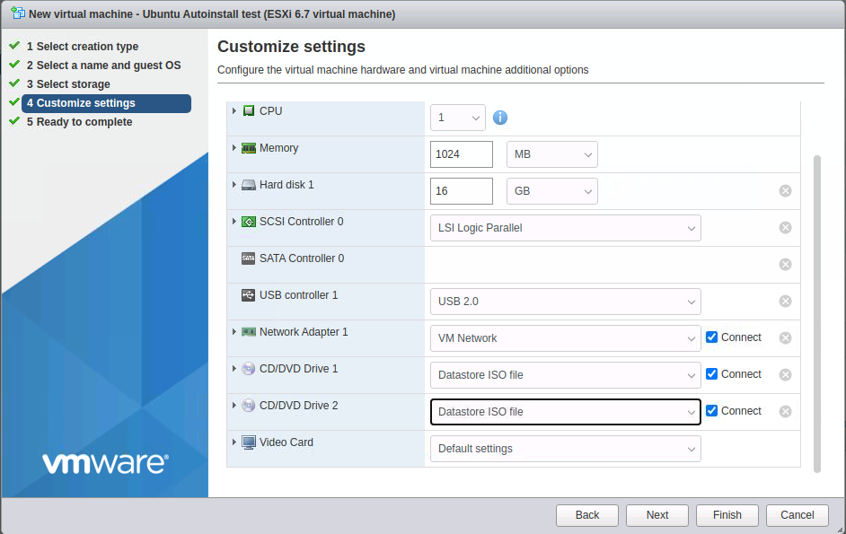

# How to run Ubuntu Autoinstall Provisioning on Various VMs

I hate bad documentation, but I figured this out.  I was using debian preseeding (d-i) for the longest time, but "they" decided to do away with it, and I was forced to adapt.  The documention is kind of scant.  I tried their converter, "autoinstall-generator," but it wouldn't work on my preseeds. Maybe they fixed it by the time you read this.  I will add to these as I see fit.  At the time of writing, this was for Ubuntu Focal Fossa (20.04) and Hirsute Hippo (21.04). It nmight also work on similarly aged Debian distros.  Who knows? 

The original documentation assumes that you have Linux KVM installed (the virtual machine service, not a keyboard-video-mouse crash cart).  I wanted some "step-by-step" instructions for those who want to try it on Oracle's VirtualBox and VMWare.

## Ubuntu Autoinstall on Oracle VirtualBox

* Download a "Ubuntu Server Live" ISO from either 20.04 (old and busted, which I heartly recommend for a long term server) or 21.04 (new hotness)
* On an Ubuntu box, intsall the cloud image utilities `apt install cloud-image-utils`
* Make a directory to keep things clean. In the example they give you, it was `~/cidata` so let's keep that to keep things simple
* Create two files in that directory: `user-data` and `meta-data`
* The file `user-data` should have, at minimum, this config:

      #cloud-config
      autoinstall:
        version: 1
        identity:
        hostname: ubuntu-server
        password: "$6$exDY1mhS4KUYCE/2$zmn9ToZwTKLhCw.b4/b.ZRTIZM30JZ4QrOQ2aOXJ8yk96xpcCof0kxKwuX1kqLG/ygbJ1f8wxED22bTL4F46P0"
        username: ubuntu

* The file `meta-data` can be empty for now
* I have a more complete `user-data` in this repo that at least installs openssh-server, open-vm-tools, and python3 (for further ansible configurations)
* Run `cloud-localds ~/seed.iso user-data meta-data` This will create `~/seed.iso` for this example.
* Launch VirtualBox
* Create an instance for Ubuntu, use a VDI hard disk however you like
* Go to Settings > Storage for the instance you created
* Have three items for the IDE controller *IN THIS ORDER*
  * Primary IDE Device 0: Your VDI hard disk
  * Primary IDE Device 1: Your Ubuntu Live CD
  * Secondary IDE Device 0: Your seed.iso

* Save and run.  You will only have to type `yes` to confirm

* It should boot off the Live CD, and use the seed.iso stuff to populate, and then you will have a piping hot fresh server in a few minutes
* Hit Enter to get to the prompt, the hashed example above password (from their docs) is "ubuntu"

## Ubuntu Autoinstall on VMWare 6.x

* Download a "Ubuntu Server Live" ISO from either 20.04 (old and busted, which I heartly recommend for a long term server) or 21.04 (new hotness) to your favorite connected datastore
* On an Ubuntu box, intsall the cloud image utilities `apt install cloud-image-utils`
* Make a directory to keep things clean. In the example they give you, it was `~/cidata` so let's keep that to keep things simple
* Create two files in that directory: `user-data` and `meta-data`
* The file `user-data` should have, at minimum, this config:

      #cloud-config
      autoinstall:
        version: 1
        identity:
        hostname: ubuntu-server
        password: "$6$exDY1mhS4KUYCE/2$zmn9ToZwTKLhCw.b4/b.ZRTIZM30JZ4QrOQ2aOXJ8yk96xpcCof0kxKwuX1kqLG/ygbJ1f8wxED22bTL4F46P0"
        username: ubuntu

* The file `meta-data` can be empty for now
* I have a more complete `user-data` in this repo that at least installs openssh-server, open-vm-tools, and python3 (for further ansible configurations)
* Run `cloud-localds ~/seed.iso user-data meta-data` This will create `~/seed.iso` for this example.
* Copy the `~/seed.iso` to your favorite datastore
* Launch VMWare server (I used ESXi because I am cheap, this probably also works with vSphere)
* Create an instance for Ubuntu, use a hard disk however you like
* In the stage where you add hardware, "Customize Settings," you're going to have to have **two** CD-ROMS
* CD/DVD Drive 1: Your "Ubuntu Server Live" ISO from your datastore
* CD/DVD Drive 2: Your `seed.iso` from your datastore

* Start the instance
* Save and run.  You will only have to type `yes` to confirm
* It should boot off the Live CD, and use the seed.iso stuff to populate, and then you will have a piping hot fresh server in a few minutes
* Hit Enter to get to the prompt, the hashed example above password (from their docs) is "ubuntu"

Sources: 
* Ubuntu Autoinstall Docs https://ubuntu.com/server/docs/install/autoinstall
* Ubuntu Autoinstall https://ubuntu.com/server/docs/install/autoinstall-quickstart
* Subiquity GitHub https://github.com/canonical/subiquity
* Curtin GitHub https://github.com/canonical/curtin
* Curtin Config documents https://curtin.readthedocs.io/en/latest/topics/config.html
* NoCloud https://cloudinit.readthedocs.io/en/latest/topics/datasources/nocloud.html

Todo
- How to stop typing "yes" - spinning your own isolinux menu options on a CD
- Use with vagrant or VBoxManage
- Doing this with a PXE server
